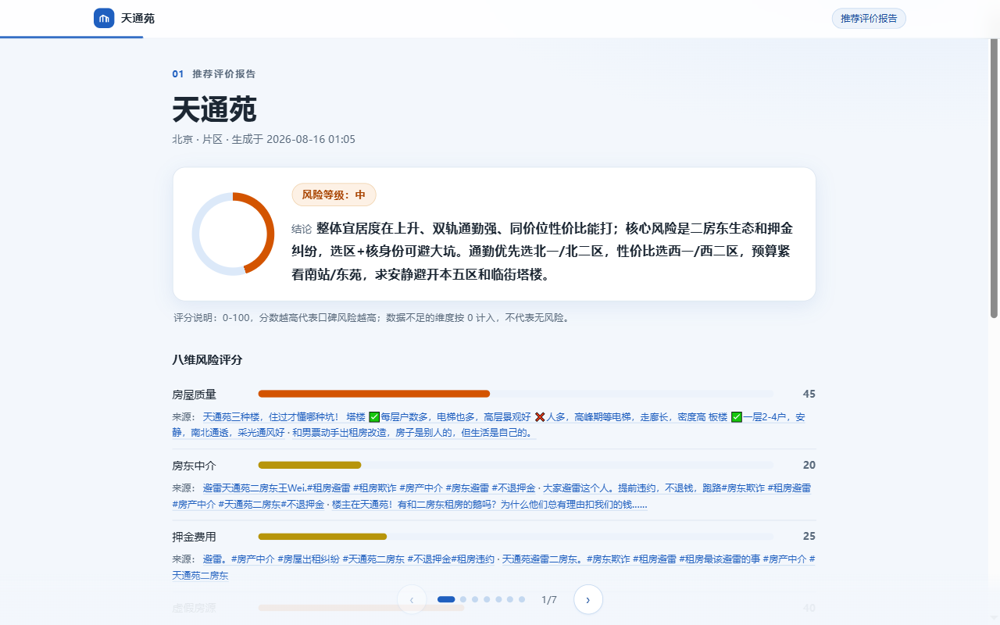

# 租租房 rent-assist

Vibe Coding 这个项目，是因为我发现越来越多的人开始通过社交媒体来找租房攻略和信息，但是这些信息又都散落在各个平台里面。所以我索性做了这个 skill：你输入需求，skill 帮你收集真实的用户讨论和房源信息，再也不用各个平台来回跑，最后还给你一份详细的租房报告，手机端电脑端都能查看。

  




## 它能做什么

租房前该搞清楚的事，直接问：

| 你问 | 它给 |
|---|---|
| "天通苑怎么样？" | 尽调报告：八维评分、风险发现、房源价格、好评精选，每条结论都能点回原帖 |
| "这家中介/房东靠谱吗？" | 口碑帖 + 12315 投诉记录交叉验证 |
| "国贸上班预算 3000 住哪合适？" | 3-5 个候选片区对比：通勤、价格、口碑 + 地图 |
| "龙泽苑有个人转租吗？" | 近 7 天转租房源卡片（点开就是原帖）+ 防骗清单 |
| "押金一般押几付几？" | 秒回直答 + 可勾选的行动清单报告 |

2019 年的好评压不过 2026 年的差评：老帖自动降权，每条证据都标发布时间。

尽调/口碑/选址类问题默认采集小红书、豆瓣、网页、抖音四平台（选址以小红书+网页+抖音为主，豆瓣对小片区命中率低不默认参与；找房以豆瓣+小红书为主——均可按需加平台）。抖音视频默认自动转写口播内容进分析。

## 装好后怎么用

打开你的 AI 助手（如果它没认出这个技能，重启一次让它重新加载），直接说人话。它会追问缺的信息（城市、预算、量级），确认后开始采集分析：

> 帮我查下回龙观龙泽苑的租房口碑，预算 3000，合租

时长看选的量级：轻量约 20 分钟、标准约 1 小时、深度约 2 小时（页面/会话里三档可选，也能自定义条数）。完成后出一份 HTML 报告，落在 `~/.rent-assist/data/reports/`（手机直接看），附一句话结论和"适合什么样的人"。同一小区 7 天内再问，直接复用上次数据，不重采。

## 准备

要用什么就准备什么——缺哪项，对应功能自动跳过并在报告里说明，不阻塞其他功能：

| 功能 | 需要准备 | 一次性操作 |
|---|---|---|
| 基础（采集/清洗/报告） | Python 3.10+（终端跑 `python --version` 确认）；一个能在终端里执行命令的 AI 助手，如 [Claude Code](https://claude.com/claude-code) 或 [Codex CLI](https://github.com/openai/codex) | — |
| 小红书源 | Chrome 浏览器 | 装好 Agent-Reach 与 Chrome 扩展后扫码登录一次（命令见下） |
| 豆瓣源 | — | 首次采集会弹浏览器，登录一次 |
| 抖音源 | — | 首次采集用抖音 App 扫码一次 |
| 地图 | 高德 key（免费，申请步骤见下方「可选配置」） | — |

### 装 Agent-Reach（采集的统一入口，一次性）

打开终端（Windows 用 PowerShell，macOS 用终端），逐条粘贴运行：

```bash
# 1) 安装（pipx 优先）
pipx install https://github.com/Panniantong/agent-reach/archive/main.zip

# 2) 先只读检查环境，确认无误后装系统依赖
agent-reach install --env=auto
agent-reach install --env=auto --system
```

**注意：只能用上面的 GitHub 地址安装。PyPI 上的同名包 agent-reach 是冒名包，不要 `pip install agent-reach`。**

<details>
<summary>pipx 装不上 / macOS 报 PEP 668 / Windows 商店版 Python：替代装法</summary>

```bash
# macOS / Linux（Homebrew Python 报 externally-managed-environment 时）
python3 -m venv ~/.agent-reach-venv && source ~/.agent-reach-venv/bin/activate
pip install https://github.com/Panniantong/agent-reach/archive/main.zip
agent-reach install --env=auto --system
```

```powershell
# Windows（PowerShell，装的是 Microsoft Store 版 Python 时）
py -3 -m venv $env:USERPROFILE\.agent-reach-venv
$env:USERPROFILE\.agent-reach-venv\Scripts\Activate.ps1
python -m pip install https://github.com/Panniantong/agent-reach/archive/main.zip
agent-reach install --env=auto --system
```

</details>

### 小红书还要两步（其他源不用）

1. Chrome 装 OpenCLI 扩展：打开 [Chrome 应用商店的 OpenCLI 页面](https://chromewebstore.google.com/detail/opencli/ildkmabpimmkaediidaifkhjpohdnifk)，点「添加至 Chrome」（浏览器扩展不允许命令行代装，这是全程唯一的手动步骤）
2. 打开终端（Windows 用 PowerShell，macOS 用终端），粘贴运行下面这条，会拉起 Chrome 扫码登录小红书，扫一次就行：

```bash
opencli xiaohongshu login
```

验证：再运行下面这条，看到 `Extension: connected` 就是通了——

```bash
opencli doctor
```

全部装完后，到「安装」节跑最后一条 `check_deps.py` 做总验证。

## 安装

同样在终端里，逐条运行（`<你的 skills 目录>` 是什么，见代码块下方说明）：

```bash
# <你的 skills 目录> = 你所用 agent 的技能目录，见下方说明
git clone https://github.com/daxueren666/zuzufang <你的 skills 目录>/rent-assist

pip install -r <你的 skills 目录>/rent-assist/requirements.txt

# 依赖自检：缺什么、怎么补，它会逐项告诉你
python <你的 skills 目录>/rent-assist/scripts/check_deps.py
```

「你的 skills 目录」= 你所用的 agent 加载技能的文件夹，clone 进去即可被识别：

- Claude Code：`~/.claude/skills/`（Windows：`%USERPROFILE%\.claude\skills\`）
- Codex CLI：`~/.codex/skills/`
- 其他 agent（Gemini CLI、Cursor 等）：一般在其配置目录下的 `skills/` 文件夹，技能格式通用

**从旧版升级**：先把旧目录整体移出 skills 目录（或删掉）再 clone 新版——留在同级的旧版备份会被识别成重复技能，可能导致触发混乱。

## 可选配置

**地图（高德 key，免费）**——不填则报告自动降级为纯文字版，其余功能不受影响：

1. 注册 [lbs.amap.com](https://lbs.amap.com)，完成个人实名认证
2. 控制台 → 应用管理 → 创建新应用 → 添加两个 Key：服务平台分别选「Web 服务」和「Web 端（JS API）」（JS API 会同时给一个安全密钥）
3. 写入 `~/.rent-assist/keys.env`（KEY=VALUE 纯文本，与 skill 目录分离）：

```ini
AMAP_WEB_KEY=Web服务的Key
AMAP_JSAPI_KEY=Web端JS_API的Key
AMAP_JSAPI_SECRET=JS_API的安全密钥
JINA_API_KEY=可选，jina.ai/reader 免费申请，提升网页源采集限额
```

## 数据与隐私

数据、密钥、登录态全部落在本机，不上传——默认 `~/.rent-assist/`，可用环境变量 RENT_ASSIST_DATA / RENT_ASSIST_TOOLS / RENT_ASSIST_KEYS 改位置，`check_deps.py` 会打印实际位置。

## 遇到问题

1. 小红书相关报错：终端跑 `opencli doctor`，没有出现 `Extension: connected` = Chrome 扩展没装好或 Chrome 没开
2. 整体自检：跑「安装」节最后一条 `check_deps.py`，缺什么它会逐项告诉你
3. 还是不行：[开个 issue](https://github.com/daxueren666/zuzufang/issues)

## 边界（必读）

只聚合公开口碑帖：这是"舆情参考"，不是"官方结论"。**无数据 ≠ 安全**，报告不构成决策依据，看房前请按报告里的核对清单实地核验。定位为个人自用工具，请低频使用，禁止批量爬取。**本 skill 仅限个人使用，不允许商业使用。**

## License

[PolyForm Noncommercial 1.0.0](LICENSE)——个人使用免费，禁止商业使用。
